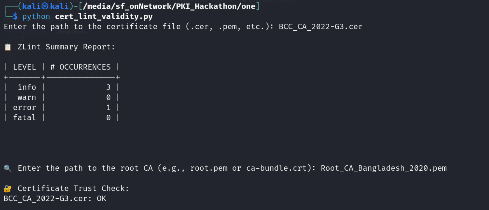

# Certificate Linting & Inspection Tool

This Python script helps you **lint**, **inspect**, and **verify trust** for certificates using [ZLint](https://github.com/zmap/zlint) and [OpenSSL](https://www.openssl.org/). It checks if your certificate is in PEM format, runs ZLint for compliance checks, displays detailed certificate information, and verifies the certificate's trust chain using a provided CA bundle.

---

## Installation

### 1. Install Python

Ensure you have Python 3.x installed. Download from [python.org](https://www.python.org/downloads/).

### 2. Install ZLint

#### On Windows (using Chocolatey):
```sh
choco install zlint
```

#### On macOS (using Homebrew):
```sh
brew install zlint
```

#### On Linux (using Go):
```sh
go install github.com/zmap/zlint/v3/cmd/zlint@latest
# Ensure $GOPATH/bin is in your PATH
```

Or download binaries from the [ZLint releases page](https://github.com/zmap/zlint/releases).

### 3. Install OpenSSL

- **Windows**: [Download OpenSSL](https://slproweb.com/products/Win32OpenSSL.html)
- **macOS**: `brew install openssl`
- **Linux**: `sudo apt install openssl`

---

## Usage

1. Save the script as `cert_lint.py`.
2. Run it:
    ```sh
    python cert_lint.py
    ```
3. Enter the path to your certificate file (e.g., `filename.pem`) when prompted. The script will check whether the file is in PEM format.
4. If the certificate is in PEM format, the script will:
    - Run ZLint and display a summary report.
    - Prompt for the path to a root CA or CA bundle file (e.g., `root.pem` or `ca-bundle.crt`).
    - Verify the certificate's trust chain using the provided CA bundle.
    - Display detailed certificate information using OpenSSL.

---
## Screenshot



---

## Example Output

```
Enter the path to the certificate file (.cer, .pem, etc.): filename.pem

📋 ZLint Summary Report:

... (ZLint output) ...

🔍 Enter the path to the root CA (e.g., root.pem or ca-bundle.crt): ca-bundle.crt

🔐 Certificate Trust Check:
filename.pem: OK

Certificate Details:

... (OpenSSL output) ...
```

If the certificate is not in PEM format:
```
❌ Only PEM format certificates are supported.
👉 To convert a DER (.cer/.der) certificate to PEM, use:
   openssl x509 -inform DER -in "your_cert.cer" -out "converted_cert.pem" -outform PEM
```

---

## Notes

- Only **PEM** format certificates are supported.
- To convert DER to PEM:
    ```sh
    openssl x509 -inform DER -in "your_cert.cer" -out "converted_cert.pem" -outform PEM
    ```
- You must provide a valid root CA or CA bundle file to verify certificate trust.

---

## License

This script is provided under the MIT License.
