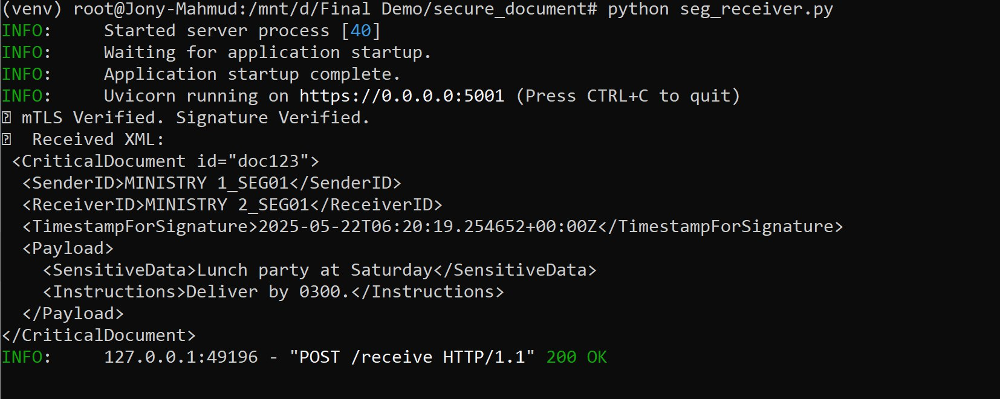
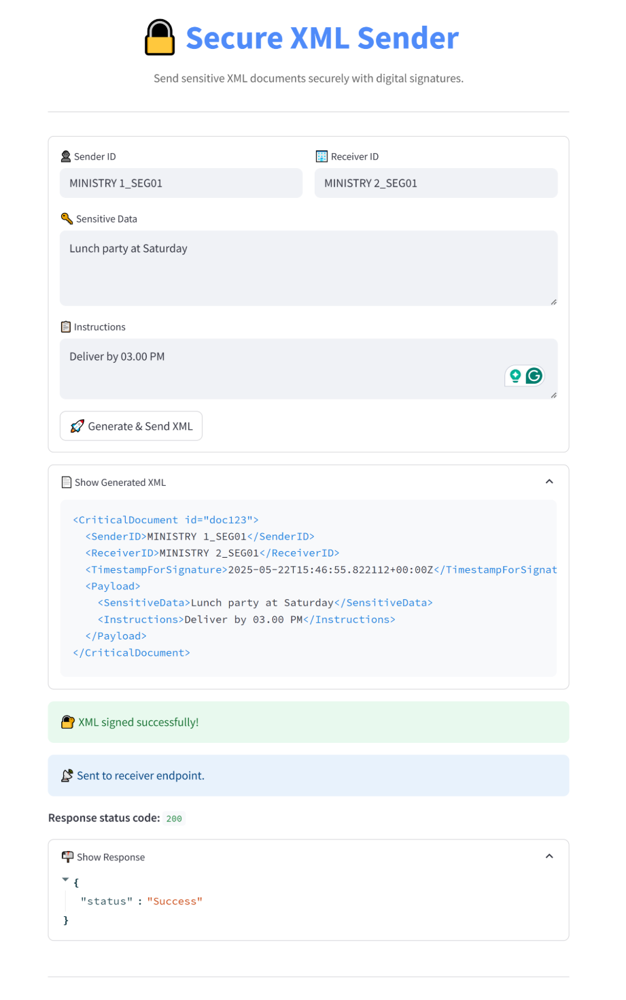

# Secure Document Exchange System (SEG)

This project demonstrates a secure communication system between two government ministries exchanging sensitive XML documents using:

- **Mutual TLS (mTLS)** for encrypted, authenticated channels
- **Digital signatures** for data integrity and sender verification
- **Self-signed Certificate Authority (CA)** and X.509 certificates for trust establishment
- **FastAPI** as the receiver server
- **Python requests** as the sender client

---

## Architecture

- **SEG-Sender:** Prepares, signs, and securely transmits XML documents via HTTPS with client certificate authentication.
- **SEG-Receiver:** FastAPI server that authenticates the sender via mTLS, verifies the XML signature, and returns the original XML document.

---

## Features

- Full mutual TLS authentication between sender and receiver
- RSA-SHA256 digital signatures for XML documents
- Certificate generation with OpenSSL including SAN for localhost
- Clear console logging of security events and errors

---

## Prerequisites

- Python 3.8+
- OpenSSL
- Git (optional)

---

## Setup Instructions

### 1. Clone the repository (or download source)

```bash
git clone https://github.com/Mehedi26696/Secure-Document-Exchange-System.git
cd Secure-Document-Exchange-System
```

### 2. Create and activate a Python virtual environment

```bash
python3 -m venv venv
source venv/bin/activate   # On Windows: venv\Scripts\activate
```

### 3. Install Python dependencies

```bash
pip install -r requirements.txt
```

### 4. Generate certificates

Navigate to the project root and run the following commands to generate all necessary certificates and keys:

```bash
# Create directory for certs (if not done)
mkdir certs
cd certs

# 1. Generate Root CA private key and self-signed certificate
openssl genrsa -out rootCA.key 4096
openssl req -x509 -new -nodes -key rootCA.key -sha256 -days 3650 -out rootCA.pem \
    -subj "/C=BD/ST=Dhaka/O=SecureGov/CN=RootCA"

# 2. Generate Sender private key and CSR
openssl genrsa -out sender.key 2048
openssl req -new -key sender.key -out sender.csr -subj "/C=BD/ST=Dhaka/O=Ministry1/CN=sender"

# 3. Sign Sender CSR with Root CA to generate Sender certificate
openssl x509 -req -in sender.csr -CA rootCA.pem -CAkey rootCA.key -CAcreateserial \
    -out sender.crt -days 365 -sha256

# 4. Create OpenSSL config file for Receiver with SAN (run this once, creates receiver_openssl.cnf)
cat > receiver_openssl.cnf <<EOF
[req]
default_bits       = 2048
prompt             = no
default_md         = sha256
req_extensions     = req_ext
distinguished_name = dn

[dn]
C = BD
ST = Dhaka
O = Ministry2
CN = localhost

[req_ext]
subjectAltName = @alt_names

[alt_names]
DNS.1 = localhost
EOF

# 5. Generate Receiver private key and CSR using the config file
openssl genrsa -out receiver.key 2048
openssl req -new -key receiver.key -out receiver.csr -config receiver_openssl.cnf

# 6. Sign Receiver CSR with Root CA including SAN extension
openssl x509 -req -in receiver.csr -CA rootCA.pem -CAkey rootCA.key -CAcreateserial \
    -out receiver.crt -days 365 -sha256 -extfile receiver_openssl.cnf -extensions req_ext

# 7. (Optional) Clean up CSR and serial files if you want
rm sender.csr receiver.csr rootCA.srl
```

---

## Running the System

### Start the SEG-Receiver

```bash
python seg_receiver.py
```

You should see Uvicorn server logs indicating it’s running with TLS.

### Run the SEG-Sender (in a new terminal)

```bash
python seg_sender.py
```

The sender will output:

```
Response: {"status":"Success"}
```

The receiver console will log:

```
✅ mTLS Verified. Signature Verified.
📄 Received XML:
<Your XML document>
```

---

## Project Structure

```
Secure-Document-Exchange-System/
├── certs/                   # Certificates and keys
├── seg_receiver.py          # FastAPI receiver server
├── seg_sender.py            # Sender client script
├── xml_utils.py             # Signing and verification helpers
├── requirements.txt         # Python dependencies
├── Screenshot               # Additional module directory (see below)
│   └── image.png           
└── README.md                # This file
```

---

## Screenshot



---



---

## How It Works

1. Sender signs the XML document with its private key.
2. Sender sends the XML and signature to the receiver over HTTPS using mTLS.
3. Receiver verifies the client certificate against the root CA.
4. Receiver verifies the digital signature using sender’s public certificate.
5. If all checks pass, the receiver accepts and logs the XML document.

---

## Security Notes

- Mutual TLS ensures both parties trust each other.
- Digital signatures prevent tampering and impersonation.
- Self-signed root CA simplifies the trust model for this prototype.

---

## License

This project is released under the MIT License.

